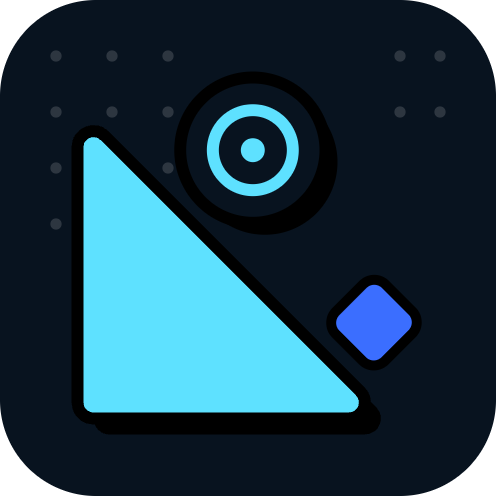
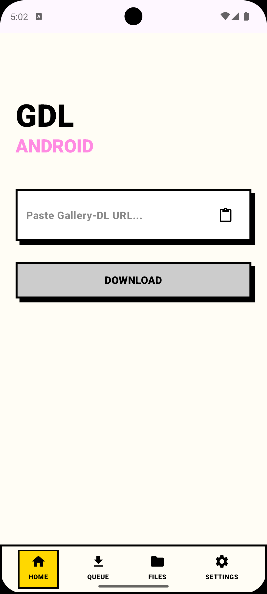
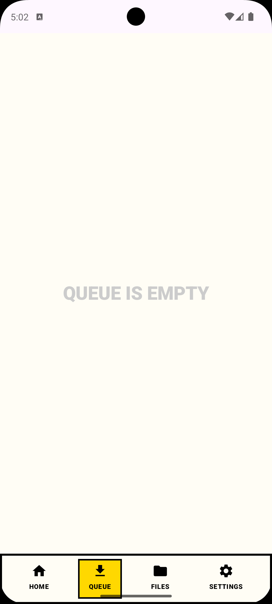
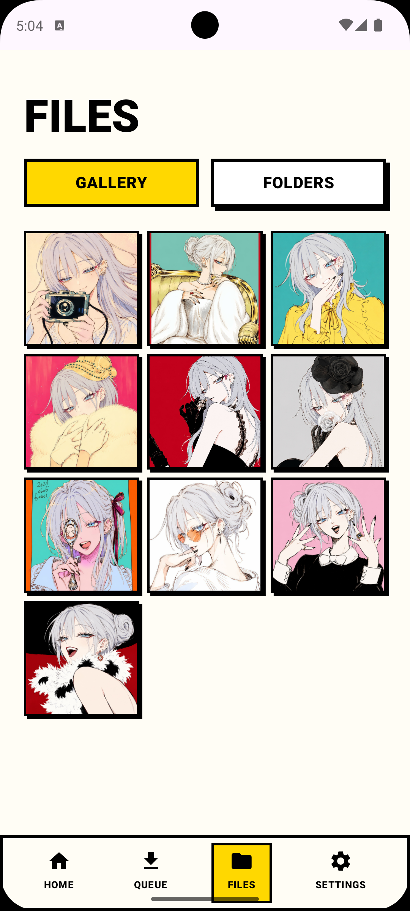
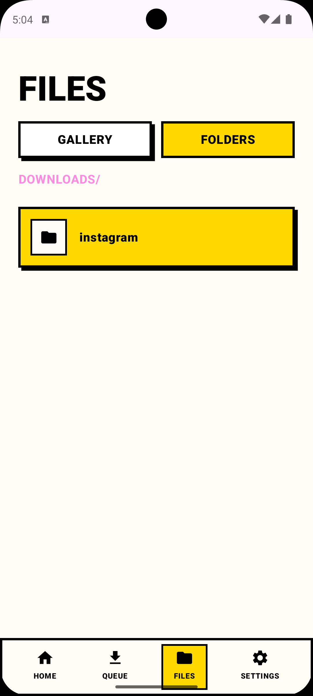
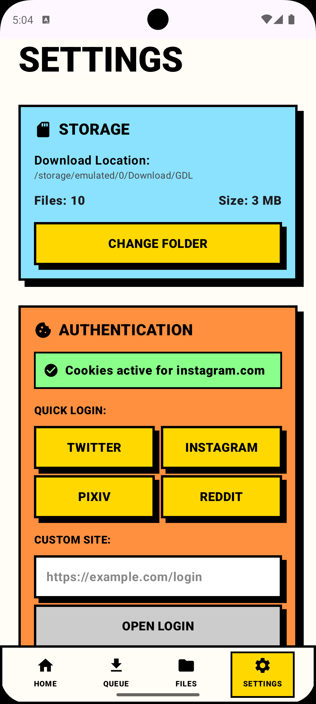

# 📦 GDL Android
<div align="center">
  

  **A Neobrutalist Android GUI for gallery-dl**
</div>

---

## 📸 Screenshots
<div align="center">
  
  
  
  
  
</div>

## ✨ Features

*   **Native Android UI:** Beautiful, bold **Neobrutalism** UI built entirely in Jetpack Compose.
*   **Powered by gallery-dl:** Uses the official Python `gallery-dl` library under the hood via Chaquopy.
*   **Background Downloads:** Uses Android Foreground Services to keep downloading even when you minimize the app.
*   **Smart Queue System:** Track exactly what's downloading, what succeeded, and what failed with color-coded status badges.
*   **Share Intent Support:** Send URLs directly from your browser to GDL Android using the native Android share menu.
*   **Custom Storage:** Downloads default to the public `/Download/GDL/` folder, or you can choose your own custom storage directory.
*   **Built-in Gallery:** View all your downloaded images in a fast, newest-first grid using Coil, or browse the raw folder structure.


## 🛠️ Technology Stack

*   **UI:** Jetpack Compose, Material 3
*   **Language:** Kotlin, Python 3.12
*   **Python Integration:** [Chaquopy](https://chaquo.com/chaquopy/)
*   **Architecture:** MVVM (Model-View-ViewModel)
*   **Dependency Injection:** Hilt / Dagger
*   **Image Loading:** Coil
*   **Navigation:** Compose Navigation (Type-Safe Serialization)

## 📦 Requirements

*   Android 8.0 (API 26) or higher.
*   Android Studio Ladybug (or newer) if building from source.

## 🚀 How to Build from Source

1. Clone the repository:
   ```bash
   git clone https://github.com/RenX86/GDL-Android.git
   ```
2. Open the project in Android Studio.
3. You must have **Python 3.12+** installed on your host machine (Windows/Mac/Linux) and available in your system PATH, as Chaquopy requires it to compile the python wheel during the Gradle build.
4. Sync Gradle and press **Run**. Chaquopy will automatically download and bundle the `gallery-dl` package.

## 📁 Project Structure

*   `app/src/main/python/gallery_dl_wrapper.py` — The Python script that interfaces with the gallery-dl library, intercepting logs and download progress.
*   `app/src/main/java/.../python/GalleryDlBridge.kt` — The Kotlin singleton that launches the Python interpreter and talks to the wrapper.
*   `app/src/main/java/.../service/DownloadService.kt` — The Foreground Service that keeps Android from killing the app during long downloads.
*   `app/src/main/java/.../ui/` — Contains all the Jetpack Compose screens (`HomeScreen`, `QueueScreen`, `FileBrowserScreen`, `SettingsScreen`) and the `NeoBrutalism.kt` theme.

## 🤝 Contributing

Contributions are welcome! If you have suggestions or want to add support for features like cookie injection or per-site authentication, feel free to open a Pull Request.

## 📝 License

This project is open-source. (Note: `gallery-dl` is licensed under GPLv2).
